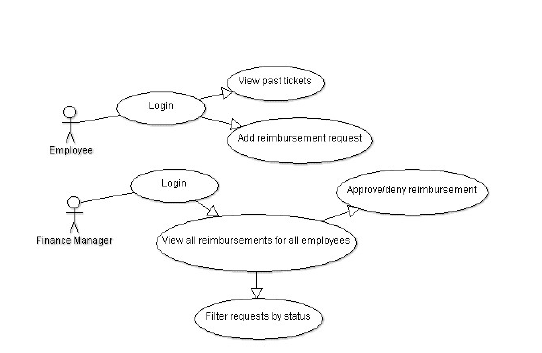
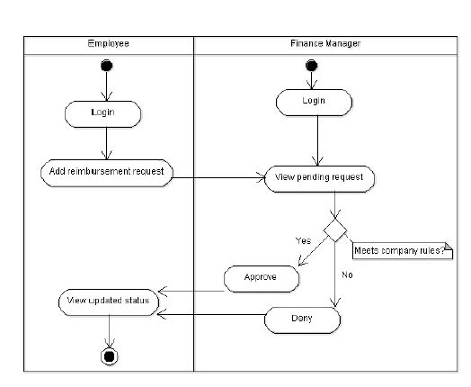

# ERS-Base
-Project 1 - FullStack application of Expense Reimbursement System 

# Overview
- The ERS application will provide employees with a reimbursement service
- The service is intended for employees to submit a ticket claim for a reimbursement, which then are sent to a manager to process the claim. 
- A Manager acts as an admin user of the system and will be in charge of approving or denying an employee claim

# Technologies
- Back-end System was implemented using Java to manage the business logic.
- JDBC was used to connect to the PostgreSQL database, and a Java Servlet was used to comunicate with the server hosted on Tomcat.
- React Typescript project was used to develop the front end.
- Ajax was used in the front-end to make calls to the server to send get or post requests. 

# User Stories

Employee:
  - Employees can Login
  - Employees can view their past ticket claims
  - Employess can make another reimbursement submission

Finance Manager:
  - Managers can Login
  - Managers can view all reimbursements for all the employees
  - Managers can filter the requested reimbursement data (Ex. by status, userId, reimbursement types ...)
  - Managers can approve or deny any request made by an Employee

Use Case Model:

Activity Diagram:

